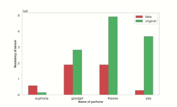
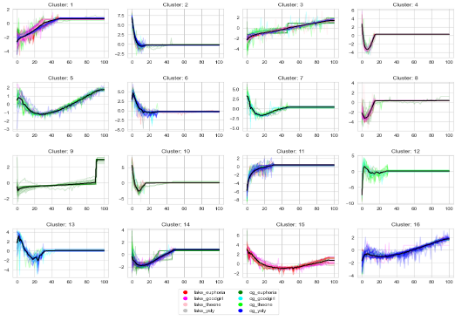

# AInose

To repozytorium jest prowadzone przez członków Koła Naukowego ATLAS i powstało w celu opracowania artykułu naukowego na IV Konferencję Kół Naukowych w ramach Politechnicznej Sieci Via Carpatia.

Celem naszego badania było zastosowanie technik analizy danych do rozróżniania złożonych lotnych związków organicznych przy użyciu elektronicznego nosa BME 688. W ramach badania przeprowadziliśmy:

- opracowanie planu strategii działania,

- zebranie zbioru danych perfum oraz ich zamienników,

- zastosowanie metod statystycznych oraz uczenia maszynowego do analizy zebranych danych.

W ramach analizy danych przeprowadziliśmy:

- eksploracyjną analizę danych dla odczytów sygnałów z zestawu sensorów,

- klastrowanie sygnałów rezystancji w celu rozpoznania wzorców w próbkach zapachowych,

- budowę modelu klasyfikacyjnego do odróżniania typów perfum.

Wyniki naszych badań zostały opisane w artykule pt. *Wykorzystanie Technik Analizy Danych do Badania Lotnych Związków Organicznych w Próbkach Perfum oraz ich Zamienników*.

</img> </img> </img> </img>
